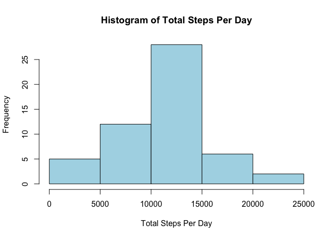
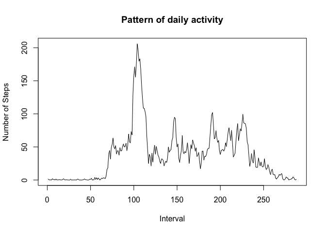
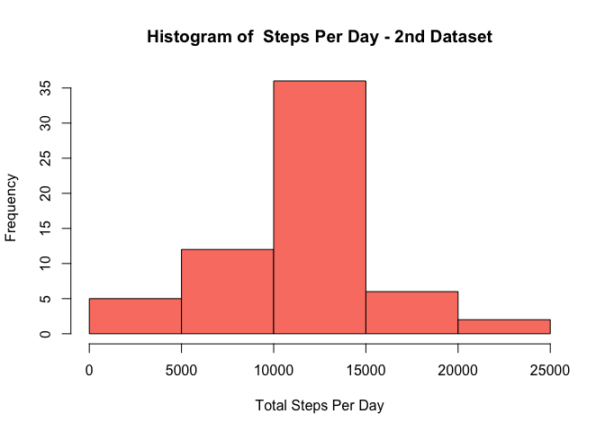
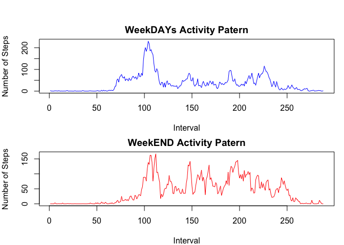

# Reproducible Research: Peer Assessment 1


### Loading and preprocessing the data

```r
## read files into memory
setwd("~/Coursera/Reproducible Research/RepData_PeerAssessment1")
dat <- read.csv("activity.csv")
dat$date <- as.POSIXct(dat$date)

# reshape tabel to a wide format: 61 rows, each is a "date" 288 columns which represent the "interval"

dat <- reshape(dat, idvar = "date", timevar = "interval", direction = "wide")
```

### What is mean total number of steps taken per day?

```r
# calculate the sum for each day (row)
r.Sums <- rowSums(dat[, 2:289])

# produce histogram and other output
hist(r.Sums, col = "lightblue", main = "Histogram of Total Steps Per Day", xlab = "Total Steps Per Day")
```

 

```r
cat("mean is: ", mean(r.Sums, na.rm = TRUE))
```

```
## mean is:  10766.19
```

```r
cat("median is: ",median(r.Sums, na.rm = T) )
```

```
## median is:  10765
```

### What is the average daily activity pattern?


```r
# Calculate the average accross all days (each "interval" column is averaged)
c.means <- colMeans(dat[, 2:289], na.rm = TRUE)

ts.plot(c.means,type = "l", xlab = "Interval", ylab = "Number of Steps",  main = "Pattern of daily activity")
```

 

```r
i <- which.max(c.means)

# extract the column name, which is the inteval. Because of the re-shaping, the column names came out as "Steps.835". Therefore use substr() to get only interval number
cat("The interval with the max number of steps is: ", substr(names(i), 7, 9))
```

```
## The interval with the max number of steps is:  835
```


## Imputing missing values


```r
cat("The total number of missing values is: ", sum(is.na(dat)))
```

```
## The total number of missing values is:  2304
```

```r
cat("These missing values appear in the following number of days (rows): ", sum(!complete.cases(dat)))
```

```
## These missing values appear in the following number of days (rows):  8
```

 

```r
dat2 <- dat[,2:ncol(dat)]   # create a second dataset, initially omitting the first column which holds the dates. 

# loop through each column and replace every "NA" with the column mean, which was calculated before.
for (i in 1:ncol(dat2)) 
  dat2[ ,i] <- sapply(dat2[, i], function(x) ifelse(is.na(x), c.means[i], x))

# attach the "date column to the beginning of the set"
dat2 <- cbind(dat$date, dat2) 
names(dat2)[1]<- "date"

# calculate the sum for each day (row)
r.Sums2 <- rowSums(dat2[, 2:289])

# produce histogram and other output
hist(r.Sums2, col = "salmon", main = "Histogram of  Steps Per Day - 2nd Dataset", xlab = "Total Steps Per Day")
```

 

```r
cat("mean is: ", mean(r.Sums2, na.rm = TRUE))
```

```
## mean is:  10766.19
```

```r
cat("median is: ",median(r.Sums2, na.rm = T) )
```

```
## median is:  10766.19
```

The means of number of steps per day have not changed between to two datasets. 
The median of dataset2 has increased to 10766 cmopared to 10765 in the original one.  


## Are there differences in activity patterns between weekdays and weekends?


```r
dat2 <- cbind("dtype" = NA, dat2) # add an empty column for the day type variable
# run condition on all dates and add the type of day accordingly
dat2$dtype <- ifelse(weekdays(dat2$date)=="Saturday" | weekdays(dat2$date)=="Sunday", "weekend", "weekday")

# calculate the means for each interval accross all dates, for both day types
c.means.weekends <- colMeans(dat2[dat2$dtype=="weekend", 3:290])
c.means.weekdays <- colMeans(dat2[dat2$dtype=="weekday", 3:290])

# draw two time series charts
par(mfrow = c(2, 1), mar = c(4, 4, 2, 1), oma = c(0, 0, 2, 0))
  plot(c.means.weekdays,type = "l", col = "blue", ylab = "Number of Steps", xlab = "Interval",  main = "WeekDAYs Activity Patern")  

  plot(c.means.weekends,type = "l", col = "red", xlab = "Interval", ylab = "Number of Steps",  main = "WeekEND Activity Patern")  
```

 
